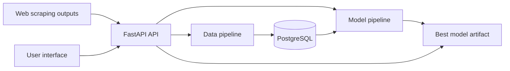

# Architecture

## Overview

The target system is a complete prediction platform with scraping-fed data ingestion, treated data persistence, model training, prediction API, and user interface.

## System Context

## Apps, Services, and Data Stores

| Component | Responsibility | Current Path |
| --- | --- | --- |
| API | Expose ingestion, training, and prediction endpoints | [../sistema/app.py](../sistema/app.py) |
| Data pipeline | Treat raw data and prepare records for training | [../sistema/src/pipeline_dados.py](../sistema/src/pipeline_dados.py) |
| Model pipeline | Benchmark, train, select, and save models | [../sistema/src/pipeline_modelos.py](../sistema/src/pipeline_modelos.py) |
| PostgreSQL | Target treated-data persistence store | Not implemented in checked-in code |
| Interface | Target user-facing application | Not implemented in checked-in code |

## External Systems

- Web scraping sources provide raw real-estate listing data.
- PostgreSQL stores treated property records in the target architecture.

## Dependency Direction

- The API orchestrates pipeline calls and prediction.
- The model pipeline depends on treated data, not raw scraped data.
- Prediction depends on the selected best model artifact.
- The interface depends on the API, not directly on pipelines or storage.

## Runtime and Deployment Context

The checked-in API is a FastAPI app. Current code uses local paths for historical data and model artifacts. The target architecture requires PostgreSQL persistence for treated records.

## Cross-Cutting Technical Rules

### ARCH-API-001: API Workflow Endpoints

**Contract:** The target API exposes `/insertData`, `/trainModels`, and `/predict` for ingestion, training, and prediction.

**Rationale:** These endpoints map to the platform's primary system workflows.

**Traceability:** [CAP-DATA-001](capabilities/data-ingestion.md#cap-data-001), [CAP-MODEL-001](capabilities/model-training.md#cap-model-001), [CAP-PREDICT-001](capabilities/price-prediction.md#cap-predict-001)

### ARCH-DATA-001: PostgreSQL Treated Data Store

**Contract:** Treated records are persisted in PostgreSQL with a saved date for training-window queries.

**Rationale:** Training requires durable, queryable, dated records.

**Traceability:** [CAP-DATA-003](capabilities/data-ingestion.md#cap-data-003), [CAP-MODEL-001](capabilities/model-training.md#cap-model-001)

### ARCH-MODEL-001: Best Model Artifact

**Contract:** The selected best model is persisted as an artifact and loaded by prediction runtime.

**Rationale:** Prediction must use a stable trained model after training completes.

**Traceability:** [CAP-MODEL-003](capabilities/model-training.md#cap-model-003), [CAP-PREDICT-001](capabilities/price-prediction.md#cap-predict-001)

### ARCH-DATA-002: Ingestion Batch Metadata and Active Records

**Contract:** PostgreSQL stores ingestion-batch metadata separately from treated property records; treated records reference their batch and include an active flag so rollback can exclude bad uploads without physical deletion.

**Rationale:** Operators need fast data-state queries, auditability, and reversible ingestion management.

**Traceability:** [CAP-DATA-004](capabilities/data-ingestion.md#cap-data-004)

### ARCH-MODEL-002: Versioned Model Registry and Active Pointer

**Contract:** PostgreSQL stores training experiments, trained-model metadata, metrics, training logs, feature importance, and a single active-model pointer; model artifacts are saved as versioned files and prediction loads the active artifact.

**Rationale:** Model operations require audit history, manual rollback to older artifacts, and protection from failed training runs replacing a usable model.

**Traceability:** [CAP-MODEL-004](capabilities/model-training.md#cap-model-004), [CAP-MODEL-005](capabilities/model-training.md#cap-model-005)

### ARCH-MODEL-003: Asynchronous Training with HTTP Polling

**Contract:** Training requests create an experiment job and return its identifier; the API runs the job asynchronously in-process and exposes status and logs through HTTP polling endpoints.

**Rationale:** Model training can be long-running, and the current deployment does not require an external queue for this stage.

**Traceability:** [CAP-MODEL-004](capabilities/model-training.md#cap-model-004), [QUAL-OBSERVABILITY-001](quality.md#qual-observability-001)

## Persistence and Data Ownership

- PostgreSQL owns treated property records and ingestion dates in the target architecture.
- PostgreSQL owns ingestion batches, experiment metadata, metrics, logs, feature importance, and the active model pointer.
- The model artifact store owns versioned trained model files.
- Current local-file persistence is an implementation state, not the final target contract.

## Security and Privacy Architecture

No authentication, authorization, or personal-data policy is specified in current project documentation. This is tracked as a verification and specification gap.

## Decisions and Tradeoffs

- Target storage is PostgreSQL, even though current code uses local files.
- The model pipeline uses only the most recent year of data to prioritize current market relevance.

## Requirement Traceability

| Architecture ID | Requirements |
| --- | --- |
| [ARCH-API-001](#arch-api-001) | [CAP-DATA-001](capabilities/data-ingestion.md#cap-data-001), [CAP-MODEL-001](capabilities/model-training.md#cap-model-001), [CAP-PREDICT-001](capabilities/price-prediction.md#cap-predict-001) |
| [ARCH-DATA-001](#arch-data-001) | [CAP-DATA-003](capabilities/data-ingestion.md#cap-data-003), [CAP-MODEL-001](capabilities/model-training.md#cap-model-001) |
| [ARCH-MODEL-001](#arch-model-001) | [CAP-MODEL-003](capabilities/model-training.md#cap-model-003), [CAP-PREDICT-001](capabilities/price-prediction.md#cap-predict-001) |
| [ARCH-DATA-002](#arch-data-002) | [CAP-DATA-004](capabilities/data-ingestion.md#cap-data-004) |
| [ARCH-MODEL-002](#arch-model-002) | [CAP-MODEL-004](capabilities/model-training.md#cap-model-004), [CAP-MODEL-005](capabilities/model-training.md#cap-model-005) |
| [ARCH-MODEL-003](#arch-model-003) | [CAP-MODEL-004](capabilities/model-training.md#cap-model-004), [QUAL-OBSERVABILITY-001](quality.md#qual-observability-001) |
